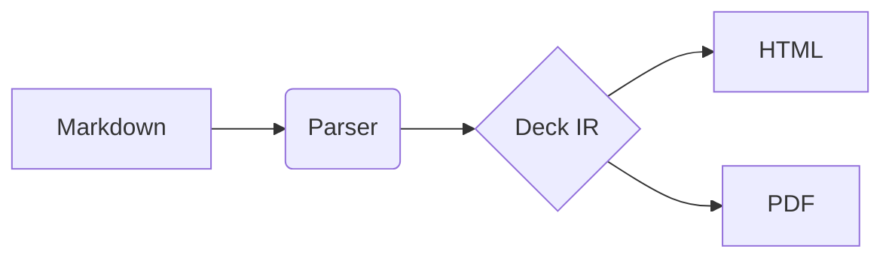

# `mermaid` renderer

A [Mermaid](https://mermaid.js.org) diagram, drawn in the deck's colours and
type. The body is Mermaid's own syntax, as plain text:

````markdown

````

Every diagram type Mermaid supports works: flowcharts, sequence, class,
state, entity–relationship, Gantt, pie, journey, mind maps, timelines, git
graphs and the rest. See [Mermaid's syntax
reference](https://mermaid.js.org/intro/syntax-reference.html).

**Colours and type come from the theme.** Nodes use the theme's surfaces
and accent, lines its muted text colour, text its font at its text size, and
pie slices and other series its chart palette, the same as charts.

**Size.** Like a chart, a diagram's block fills the slide's width and is
`--blitz-block-height` tall; set `height=` or `style=` on the fence to change
it. The diagram is drawn at its natural size and centred, and scaled *down*
if that's bigger than the block, never up, so its text never gets bigger
than the slide's.

**Steps.** The block takes a step and an effect like any other (`{@2}`,
`{.fade-up @+}`). The diagram fades in when it's drawn.

**Screen readers** *(1.1)*. Mermaid's own accessibility lines work, in the
diagram's source: `accTitle: Build pipeline` names the diagram, and
`accDescr: Markdown is parsed…` (or a `accDescr { … }` block over several
lines) describes it. `alt=` on the fence names it too, and wins over
`accTitle` (syntax.md §8.2).

**Mistakes.** A diagram Mermaid can't parse shows Mermaid's message on the
slide, and `blitzstrahl check` reports it at the block's line. (A few diagram
types can only be checked in a browser; for those, the slide is where you'll
see it.)

**Weight.** Mermaid is large. A static build loads it only when a slide with
a diagram is shown, and then only the parts that diagram type needs. A
standalone file has to carry all of it: expect about 5 MB.
