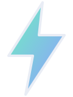

<style>
.blitz-slide .row { display: flex; gap: 28px; align-items: stretch; }
.blitz-slide .stack { display: flex; flex-direction: column; gap: 18px; width: 620px; }
.blitz-slide .card {
  flex: 1; padding: 22px 28px; border-radius: 16px;
  background: var(--blitz-surface-2); box-shadow: 0 0 0 1px var(--blitz-rule), 0 18px 40px rgba(0, 0, 0, .35);
}
.blitz-slide .card p { margin: 0; }
.blitz-slide .card .label { font-weight: 700; color: var(--blitz-accent); }
.blitz-slide .card .more { font-size: var(--blitz-text-small); color: var(--blitz-fg-muted); margin-top: 6px; }
.blitz-slide .corner { position: absolute; right: 88px; top: 60px; width: 64px; }
.blitz-slide .hero { width: 150px; }
.blitz-slide .aside { color: var(--blitz-fg-muted); font-size: var(--blitz-text-small); }
.blitz-slide .huge { font-size: 96px; margin: 40px 0 0; }
</style>

{key=logo .hero alt="blitzstrahl"}

# Everything that stays, moves

`auto-animate`, and nothing else to learn

::: notes
The whole deck uses one transition. Every slide shares something with the
one before it, and that is all it takes.
:::

---

{key=logo .corner alt="blitzstrahl"}

## Everything that stays, moves

Two slides share a title, an image, a list item, a card, a line of code.
Put `transition: auto-animate` on the second, and each shared element
travels from where it was to where it is.

::: notes
The title shrank and moved; the logo flew into the corner. Nothing was
keyed except the logo.
:::

---

{key=logo .corner alt="blitzstrahl"}

## One pipeline

:::: row
::: card {key=md}
[Markdown]{.label}
:::
::: card {key=ir}
[Deck IR]{.label}
:::
::: card {key=html}
[HTML]{.label}
:::
::::

---

{key=logo .corner alt="blitzstrahl"}

## One pipeline

:::: stack
::: card {key=md}
[Markdown]{.label}

[What you write, with `{…}` for steps and effects.]{.more}
:::
::: card {key=ir}
[Deck IR]{.label}

[The contract: what renderers, themes and exporters read.]{.more}
:::
::: card {key=html}
[HTML]{.label}

[One page, or one file that runs from disk.]{.more}
:::
::::

::: notes
Same three cards, keyed: they move from a row into a column and grow.
:::

---

{key=logo .corner alt="blitzstrahl"}

## A list that grows

- Collect
- Chart

---

{key=logo .corner alt="blitzstrahl"}

## A list that grows

- Collect
- Clean
- Chart
- Tell the story

::: notes
The two items that were already there make room; the new ones fade in.
:::

---

{key=logo .corner alt="blitzstrahl"}

## …and reorders

- Tell the story
- Collect
- Chart
- Clean

---
layout: code
---

## Code, one change at a time

```ts
function total(prices) {
  let sum = 0
  for (const p of prices) sum += p
  return sum
}
```

---
layout: code
---

## Code, one change at a time

```ts
function total(prices: number[]): number {
  let sum = 0
  for (const p of prices) sum += p
  return sum
}
```

::: notes
Tokens that stayed slide over to make room for the types.
:::

---
layout: code
---

## Code, one change at a time

```ts {lines="1|2|all"}
const total = (prices: number[]): number =>
  prices.reduce((sum, p) => sum + p, 0)
```

::: notes
The loop folds into a reduce; the name, the types and the arrow stay put.
Then `lines=` walks through it.
:::

---

{key=logo .corner alt="blitzstrahl"}

## Math, typeset when the deck is built

$$
E = mc^2
$$ {key=energy .huge}

---

{key=logo .corner alt="blitzstrahl"}

## Math, typeset when the deck is built

Energy and mass are one thing, measured twice:

$$
E = mc^2
$$ {key=energy}

[With $c \approx 3 \times 10^8\,\mathrm{m/s}$, a gram of anything holds about $9 \times 10^{13}$ joules.]{.aside}

---

{key=logo .corner alt="blitzstrahl"}

## Revenue by region

```chart {key=sales}
type: bar
data: ../palette/sales.csv
x: quarter
y: revenue
stack: region
```

---
layout: two-col
---

{key=logo .corner alt="blitzstrahl"}

## Revenue by region

::: left
Asia overtook Europe in Q3.

Americas still leads, but the gap is closing.
:::

::: right
```chart {key=sales}
type: bar
data: ../palette/sales.csv
x: quarter
y: revenue
stack: region
```
:::

---
layout: end
---

{key=logo .hero alt="blitzstrahl"}

# That's the move

Write two slides. Share what stays.
