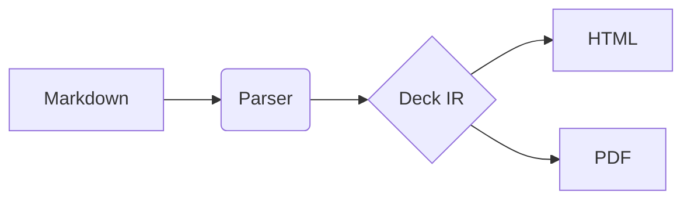

# A heavy deck

A chart, a map, a diagram and an embedded page: what a presenter view
has to carry (M12.4).

---

# Revenue

```chart
type: bar
data:
  - { region: North, q1: 120, q2: 135 }
  - { region: South, q1: 90, q2: 110 }
  - { region: East, q1: 70, q2: 85 }
  - { region: West, q1: 60, q2: 75 }
```

---

# Stores

```map
markers: ./cities.csv
label: city
size: stores
tiles: osm
```

---

# Flow



---

# Live

```embed
src: https://embed.test/page
title: The live dashboard
```

---

# Thanks
