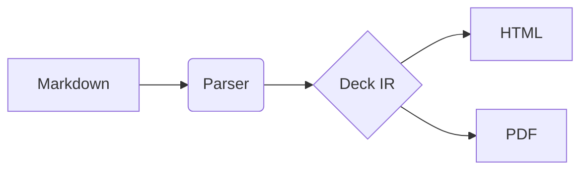
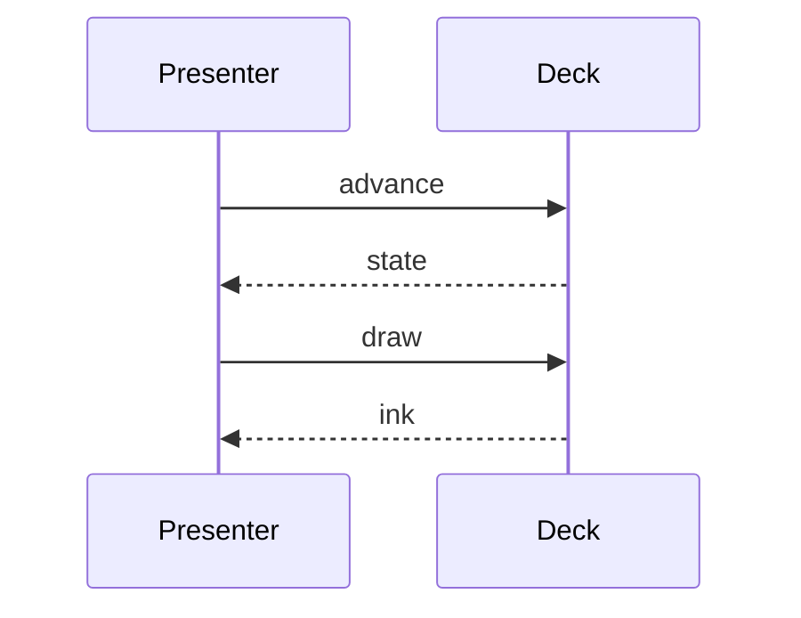
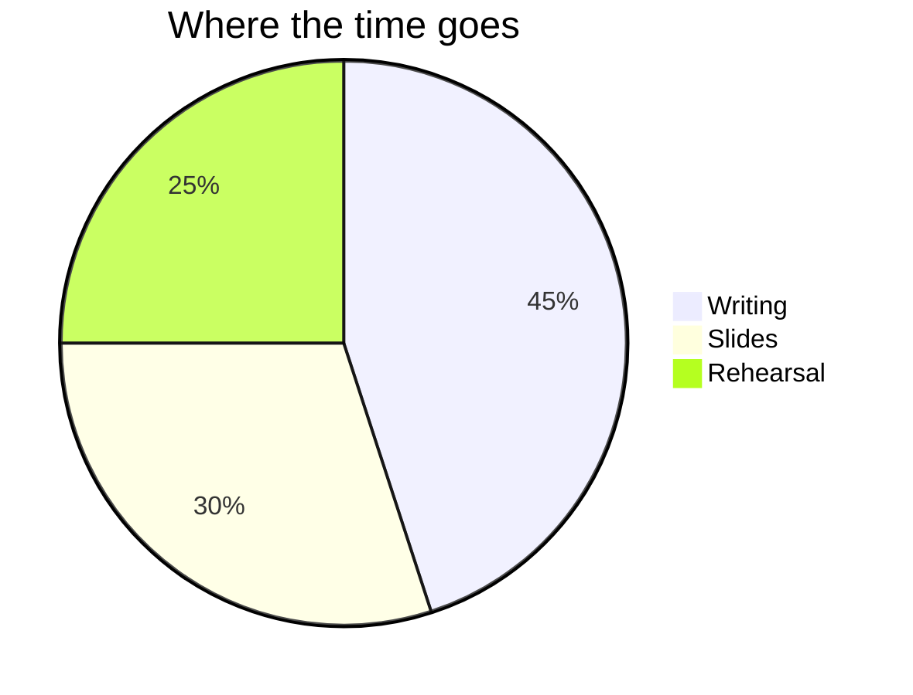
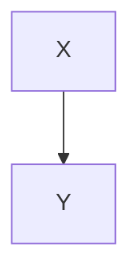

# Diagrams

---

# Flow

```mermaid {#flow}
flowchart LR
  A[Markdown] --> B(Parser)
  B --> C{Deck IR}
  C --> D[HTML]
  C --> E[PDF]
```

---

# Sequence

```mermaid {#seq}
sequenceDiagram
  Presenter->>Deck: advance
  Deck-->>Presenter: state
  Presenter->>Deck: draw
  Deck-->>Presenter: ink
```

---

# Pie

```mermaid
pie title Where the time goes
  "Writing" : 45
  "Slides" : 30
  "Rehearsal" : 25
```

---

# Later {#later-slide}

Intro {@1}

```mermaid {#stepped @2}
flowchart TD
  X --> Y
```

---

# Broken

```mermaid
flowchart LR
  A -->
```
