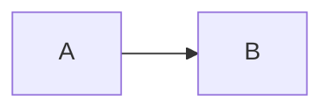

# Descriptions

```chart {alt="Revenue doubled from Q1 to Q4."}
type: bar
data: ./sales.csv
```



```embed {alt="The project's home page"}
src: https://example.org/
```

```math {alt="E equals m c squared"}
E = mc^2
```

{alt="Kept as written"}
