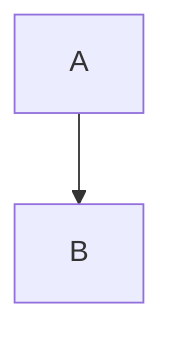

# Charts

```chart {@2 dur=600}
type: bar
data: ./data/../sales.csv
x: quarter
y: revenue
note: not/a/path
```

```chart
type: line
data:
  - { quarter: Q1, revenue: 1 }
  - { quarter: Q2, revenue: 3 }
x: quarter
y: revenue
```

```chart
type: [unclosed
```

```map {@1}
center: [41.38, 2.17]
```



```yaml
type: bar
```

 
